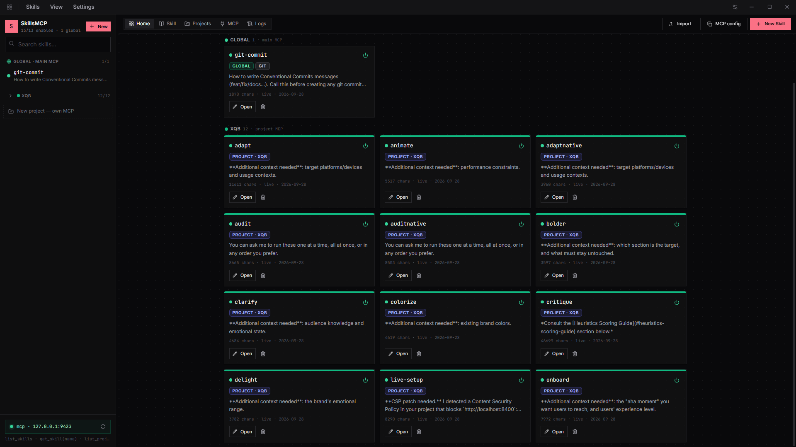
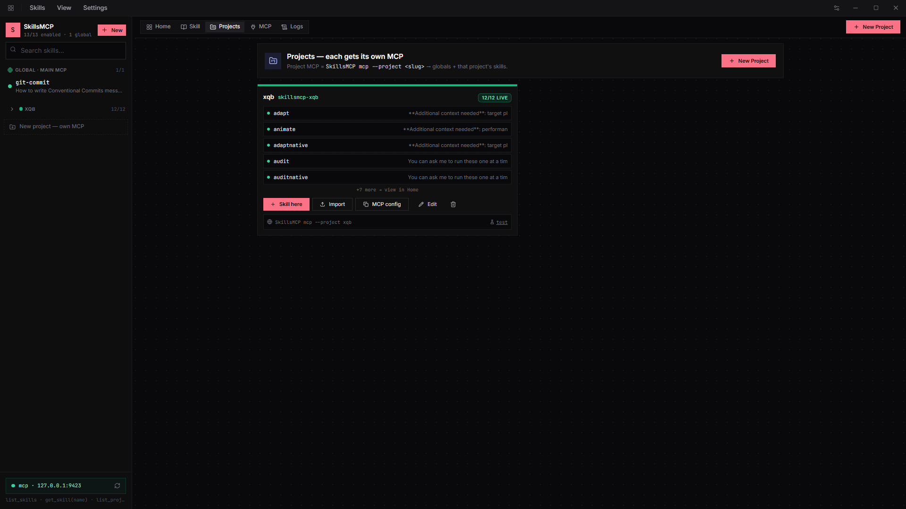
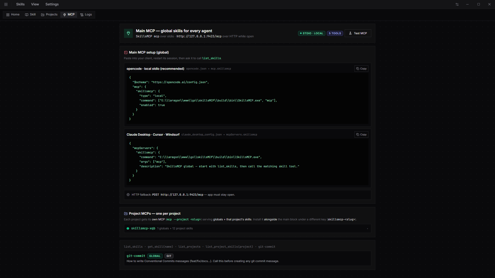
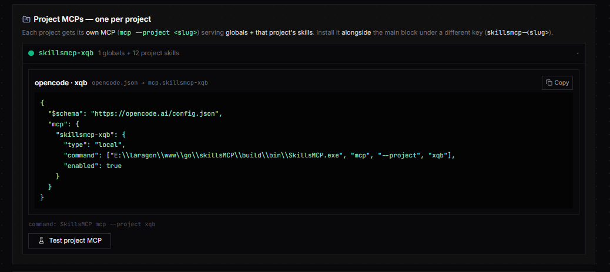
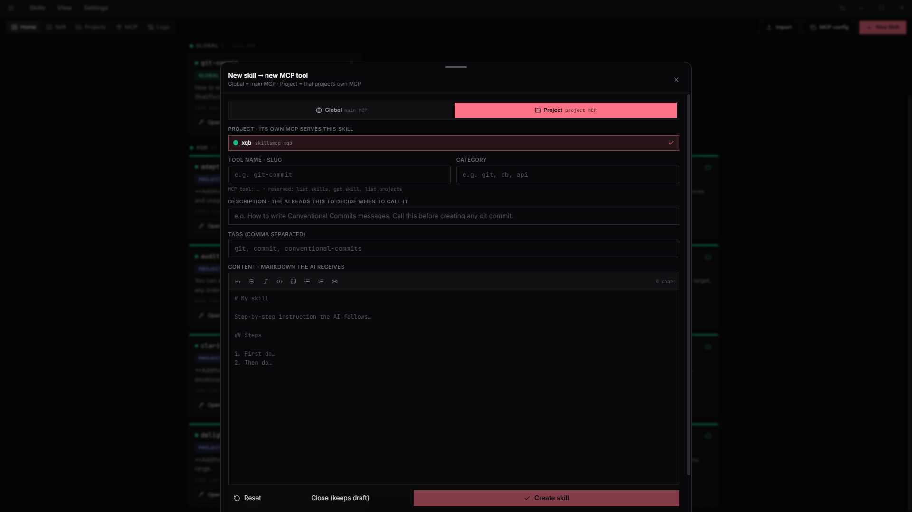

# SkillsMCP

[](https://github.com/iMohamedSheta/skillsmcp/actions/workflows/ci.yml)
[](https://github.com/iMohamedSheta/skillsmcp/releases/latest)

One binary, no installer. Your prompt skills, callable as MCP tools —
global skills on the main MCP, project skills on their own MCP.

```
You ──desktop app──▶ skills.db ──MCP──▶ AI agent
                          │
          main MCP:  SkillsMCP mcp                 → globals
          project:   SkillsMCP mcp --project <slug> → globals + project
          control:   SkillsMCP mcp --control        → manage everything (write tools)
```

Skills are Markdown instructions you write once and reuse everywhere.
Toggle a skill on and its MCP tool goes live instantly — no restart,
no redeploy, no config edit.



## Download

Open the [**latest release**](https://github.com/iMohamedSheta/skillsmcp/releases/latest)
and pick your OS. Per-OS screenshots (`screenshot-windows/macos/linux.png`) ship next
to the binaries — all seeded defaults, never your real skills.

| OS | File | Run |
|---|---|---|
| Windows 10/11 (x64) | `SkillsMCP-Windows-amd64.exe` (`SkillsMCP.exe` is the same file) | Double-click. If SmartScreen warns (unsigned): **More info → Run anyway** |
| macOS (Universal: Intel + Apple Silicon) | `SkillsMCP-macOS-universal.zip` | Unzip, drag `SkillsMCP.app` to Applications, right-click → Open on first launch (unsigned) |
| Linux (x64) | `SkillsMCP-Linux-amd64.tar.gz` | `tar xzf … && ./SkillsMCP` (needs WebKitGTK on minimal distros: `libwebkit2gtk-4.1`) |

Data lives in `~/.skillsmcp/skills.db` on every OS (`%USERPROFILE%\.skillsmcp\skills.db`
on Windows). Override the folder with `SKILLSMCP_HOME` (also used to run an isolated copy).

`SkillsMCP --version` prints the embedded release tag (`dev` for local builds;
Settings shows it too). `SkillsMCP mcp [--project <slug>]` runs the MCP server on stdio.

## Updating

The app checks [GitHub Releases](https://github.com/iMohamedSheta/skillsmcp/releases/latest)
for a newer build: once a day on startup (Settings → General toggles
it off), plus a manual **Check now** button. When an update is found a banner
appears under the menu with the release notes.

- **Windows / Linux:** one click — **Download & install** fetches the asset to
  `~/Downloads`, swaps the binary, and restarts the app on the new version.
- **macOS:** the `.zip` is downloaded to `~/Downloads`; unzip it and drag
  `SkillsMCP.app` to Applications (same unsigned-app flow as a fresh install).

Downloads only ever come from `github.com` / `*.githubusercontent.com` over
HTTPS, and the banner offers **Skip this version** per release. Forks can point
the checker at their own repo with `SKILLSMCP_UPDATE_REPO=owner/repo`.

## Contents

- [How it works](#how-it-works)
- [Workspaces & git sync](#workspaces--git-sync)
- [Screenshots](#screenshots)
- [MCP install](#mcp-install)
- [Tools](#tools)
- [Importing & exporting](#importing--exporting-skills)
- [Data, troubleshooting](#data-troubleshooting)
- [Build from source](#build-from-source)
- [Releasing](#releasing)
- [Project layout](#project-layout)

## How it works

- **Desktop app edits skills** — name, description, Markdown content, category,
  tags, scope (global vs project). Everything is stored in `~/.skillsmcp/skills.db`
  (SQLite WAL, one file, no server).
- **MCP serves over stdio** (`SkillsMCP.exe mcp` — same binary, no window)
  and HTTP (`127.0.0.1:9423/mcp` while the app is open).
- **Tools are dynamic**: `tools/list` is rebuilt from SQLite on every call,
  so a skill you create, edit, or toggle in the UI goes live instantly —
  no restart, no rebuild.
- **Global vs project**: global skills ride the main MCP (`SkillsMCP mcp`);
  each project gets its own MCP (`SkillsMCP mcp --project <slug>`) serving
  globals + that project's skills. Install it alongside the main block under
  a different key (`skillsmcp-<slug>`).
- **Enable toggle = publish switch**: disabling a skill hides its MCP tool
  on the next `tools/list`. Deleting a project deletes its skills too —
  move anything worth keeping to Global first.
- **Control MCP manages the app**: `SkillsMCP mcp --control`
  (`skillsmcp-control`) lets an agent create/update/delete/enable skills,
  create projects and workspaces, push/pull git repos, and explain the app
  (`app_help`). Install it alongside the main block — everyday sessions
  stay read-only, management opts in.
- **Workspaces**: the **Main** workspace is personal (everything above).
  Extra workspaces hold their own globals + projects, sync to their own
  git repo, and ride their own MCPs (`skillsmcp-<workspace>`,
  `skillsmcp-<workspace>-<project>`). See [Workspaces & git sync](#workspaces--git-sync).
- **Default seed**: `git-commit` (Conventional Commits). Add more from the UI
  with **New Skill** or bulk-import `.md` files.

## Screenshots

### Home — all skills, global live on the main MCP

Filter `All / Global / <project>`, open any card to preview and edit it live.


### Projects — each gets its own MCP

One card per project with its skills, `Skill here` / `Import` / `MCP config` actions,
and the exact stdio command (`SkillsMCP mcp --project xqb`).



### MCP — copy-paste client configs

Main MCP setup (opencode local stdio, Claude Desktop / Cursor / Windsurf) plus
per-project blocks and a self-test button.





### New skill → new MCP tool

Pick Global (main MCP) or a Project (that project's own MCP), set slug, category,
description, tags, and the markdown the AI receives — **Create skill** puts it
live immediately.



## MCP install

`SkillsMCP → MCP tab → Copy`, or paste manually.

opencode — global (`opencode.json` → `mcp.skillsmcp`):

```json
{
  "$schema": "https://opencode.ai/config.json",
  "mcp": {
    "skillsmcp": {
      "type": "local",
      "command": ["C:\\path\\to\\SkillsMCP.exe", "mcp"],
      "enabled": true
    }
  }
}
```

opencode — project (`opencode.json` → `mcp.skillsmcp-<slug>`, alongside the main block):

```json
{
  "$schema": "https://opencode.ai/config.json",
  "mcp": {
    "skillsmcp-xqb": {
      "type": "local",
      "command": ["C:\\path\\to\\SkillsMCP.exe", "mcp", "--project", "xqb"],
      "enabled": true
    }
  }
}
```

opencode — workspace (`SkillsMCP → Workspace tab → opencode JSON`, or paste manually):

```json
{
  "$schema": "https://opencode.ai/config.json",
  "mcp": {
    "skillsmcp-team": {
      "type": "local",
      "command": ["C:\\path\\to\\SkillsMCP.exe", "mcp", "--workspace", "team"],
      "enabled": true
    },
    "skillsmcp-team-api": {
      "type": "local",
      "command": ["C:\\path\\to\\SkillsMCP.exe", "mcp", "--workspace", "team", "--project", "api"],
      "enabled": true
    }
  }
}
```

Claude Desktop / Cursor / Windsurf (`mcpServers` shape):

```json
{
  "mcpServers": {
    "skillsmcp": {
      "command": "C:\\path\\to\\SkillsMCP.exe",
      "args": ["mcp"]
    }
  }
}
```

Control MCP — agent manages the app (`SkillsMCP → MCP tab → Control MCP → Copy`,
or paste manually). Install alongside the main block:

```json
{
  "$schema": "https://opencode.ai/config.json",
  "mcp": {
    "skillsmcp-control": {
      "type": "local",
      "command": ["C:\\path\\to\\SkillsMCP.exe", "mcp", "--control"],
      "enabled": true
    }
  }
}
```

Verify: `opencode run "using skillsmcp list_skills, what skills are available?"`

## Tools

| Tool | What it does |
|---|---|
| `list_skills` | Index (name + description) — the AI starts here |
| `get_skill {name}` | Full markdown for one skill |
| `list_projects` | Project list (each has its own MCP) |
| `list_project_skills {project}` | Skills in one project |
| `<skill-name>` | Shortcut tool per enabled skill (e.g. `git-commit`), description = skill description |

Control MCP only (`SkillsMCP mcp --control` → `skillsmcp-control`):

| Tool | What it does |
|---|---|
| `app_help` | Management playbook — call first in a management session |
| `create_skill {name, description, content, …}` | New skill, global or project-scoped, live instantly |
| `update_skill {name, …}` | Edit a skill (only passed fields change) |
| `delete_skill {name}` | Permanently delete a skill |
| `set_skill_enabled {name, enabled}` | Publish switch without deleting |
| `create_project {name, …}` | New project (+ its own MCP) |
| `update_project {project, …}` | Edit a project (only passed fields change) |
| `delete_project {project}` | Delete a project + its skills (globals kept) |
| `export_skills {scope, project?, workspace?}` | Lossless archive manifest JSON (restore with import_skills) |
| `import_skills {archive, …}` | Restore an archive (duplicates skipped, project recreated) |
| `list_workspaces` | Workspace list (main + linked repos + counts) |
| `create_workspace {name, …}` | New workspace (+ its own MCPs) |
| `update_workspace {workspace, …}` | Edit a workspace (only passed fields change) |
| `delete_workspace {workspace}` | Delete a workspace + everything in it (main protected) |
| `set_workspace_git {workspace, remote, branch?, token?}` | Link/unlink a repo (SSH, or HTTPS + private token) |
| `push_workspace {workspace?}` | Commit + push the workspace to its repo || `pull_workspace {workspace?}` | Pull the repo and restore skills |
| `workspace_status {workspace?}` | Sync state (branch, clean/dirty, ahead/behind) |
| `clone_workspace {name, remote, branch?, token?}` | Connect a repo as a workspace + import all |

Most skill/project tools accept an optional `workspace` slug (default main).

HTTP fallback while the app is open: `POST http://127.0.0.1:9423/mcp`.

Recommended agent workflow: `list_skills` → pick the match → `get_skill(name)`
(or call `<skill-name>` directly) → follow the returned Markdown.

## Importing & exporting skills

**Import** (Home header, or per-project) bulk-loads `.md` files as skills:

- Filename becomes the skill slug (`my-deploy.md` → `my-deploy`).
- First `# heading` becomes the description fallback; `# Skill: name — description`
  headers and `> quote` / frontmatter descriptions are parsed when present.
- Choose **Global** (main MCP) or a **Project** (that project's MCP) as the target.
- Duplicates are skipped with a count, not overwritten.

**Export** (Home header for globals, per-project card for projects) downloads a
lossless `.zip` archive: `manifest.json` (every skill with name, description,
content, category, tags, enabled state and order, plus the project meta for
project exports) alongside readable `skills/*.md` files.

**Restore** the `.zip` via Import — no edits needed:

- Global archives come back as global skills; project archives land in the
  matching project slug, recreating the project (name, description, color)
  when it doesn't exist.
- Duplicates are skipped with a count, never overwritten.

Agents use the same format through the control MCP: `export_skills`
returns the archive manifest JSON, `import_skills` restores it.

## Workspaces & git sync

One library per context. The **Main** workspace is personal — it is the
library this app had before workspaces existed (same DB, same MCP names,
existing client configs keep working). Extra workspaces hold their own
global skills + projects, sync to their own git repo, and expose their
own MCPs:

```
You ──desktop app──▶ skills.db ──MCP──▶ AI agent
                        ├── Main (personal):  skillsmcp / skillsmcp-<project>
                        └── team (synced):    skillsmcp-team / skillsmcp-team-<project>
                                                    ↕ git push / pull
                                              github.com/org/team-skills (.git)
```

- **Create**: sidebar `+ New workspace`, or control MCP `create_workspace`.
  Switch with the sidebar selector (remembered per install).
- **Each workspace**: own globals, own projects (slugs reuse across
  workspaces), own git link, own MCPs. Skill names are unique *per
  workspace*. Deleting a workspace deletes everything in it (Main is
  protected).
- **Link a repo** (Workspace tab, or `set_workspace_git`): any git URL —
  SSH (`git@github.com:org/skills.git`, uses your keys/agent, no token
  needed) or HTTPS. For **private HTTPS repos** paste a token (e.g. a
  GitHub PAT): it is stored locally in `skills.db`, never shown again
  (reads only report `hasToken`), never written into the repo, and sent
  per-command as an `AUTHORIZATION: Bearer` header. Empty token keeps the
  saved one; changing remote without a token drops the old one; unlinking
  (empty remote) drops it too. Public or private. Empty remote = local-only.
- **Push** writes `workspace.json` + `globals/` + `projects/<slug>/`
  (the lossless archive format: `manifest.json` + readable `.md` files),
  commits when dirty, and pushes to the linked branch. **Pull** fetches
  and restores (missing projects recreated, existing names skipped).
  Manual only — nothing syncs itself. Checkouts live in
  `~/.skillsmcp/workspaces/<slug>/repo`.
- **Connect a repo as a workspace** (`Clone workspace` card, or
  `clone_workspace {name, remote, branch?, token?}`): clones (private repos work
  with your SSH keys or a token) and imports every skill; each
  project inside keeps its own MCP.
- **Agent workflow**: `list_workspaces` → `mcp --workspace <slug>` for
  daily use; management via `skillsmcp-control`
  (`create_workspace`, `push_workspace`, `pull_workspace`,
  `workspace_status`, `clone_workspace`, plus every skill/project tool
  with an optional `workspace` slug).

## Data, troubleshooting

- Store: `~/.skillsmcp/skills.db` (SQLite WAL). Delete it to reset to the `git-commit` seed.
  Override the folder with `SKILLSMCP_HOME` (also used for isolated screenshot profiles).
  Workspace git checkouts live in `~/.skillsmcp/workspaces/<slug>/repo`.
- Logs: in-app **Logs** tab (Settings → Logs shows the path). Backend errors land there —
  reproduce, hit reload, paste the red lines.
- If the app ever shows a blank page: quit **every** SkillsMCP process, then launch fresh
  (Windows: end them in Task Manager. macOS: Cmd+Q. Linux: `pkill SkillsMCP`).
- MCP client can't connect: make sure the command path points at the built
  `build/bin/SkillsMCP.exe`, restart the client session after editing its config,
  and use the in-app **Test MCP** button to verify (it runs the exact stdio handshake
  opencode does).

## Build from source

```bash
go mod tidy
# Windows:
wails build -platform windows/amd64 -o SkillsMCP.exe   # build/bin/SkillsMCP.exe
# macOS (Universal: Intel + Apple Silicon):
wails build -platform darwin/universal -o SkillsMCP    # build/bin/SkillsMCP.app
# Linux:
wails build -platform linux/amd64 -o SkillsMCP         # build/bin/SkillsMCP
wails dev            # desktop + hot reload
cd frontend && npm install && npm run dev   # frontend only
```

Linux needs WebKitGTK dev packages once:
`sudo apt install libgtk-3-dev libwebkit2gtk-4.1-dev`.

`SkillsMCP --version` prints the baked-in release tag (`dev` for local builds).
`SkillsMCP mcp [--project <slug>]` runs the MCP server on stdio.

## Releasing

Every push to `main` publishes a new GitHub Release automatically
(`.github/workflows/release.yml`): the same version is built on Windows, macOS,
and Linux with the version baked in
(`-ldflags "-X skillsmcp/internal/version.Version=v…"`), each launched against
a fresh isolated profile (`SKILLSMCP_HOME`) and screenshotted while running,
and uploaded as
`SkillsMCP-Windows-amd64.exe` (+ `SkillsMCP.exe` alias),
`SkillsMCP-macOS-universal.zip`, `SkillsMCP-Linux-amd64.tar.gz`,
plus `screenshot.png` (Windows hero) and per-OS shots.

The version bump follows [Conventional Commits](https://www.conventionalcommits.org/):

| Commit message | Bump |
|---|---|
| `feat: ...` / `feat(scope): ...` | minor (`x.Y.0`) |
| `fix: ...` / `fix(scope): ...` | patch (`x.y.Z`) |
| `...!:` / `BREAKING CHANGE` in body | major (`X.0.0`) |
| anything else (`docs:`, `chore:`, …) | patch |

Add `[skip release]` to the HEAD commit message to skip publishing.
Pushes that don't touch the shipped app (docs, `docs/`, `.github/`, `scripts/`)
are skipped automatically — they batch up into the next app release instead.
Pull requests and pushes run `CI` instead: `go build`, `go test`, `go vet`,
`staticcheck` (bug detection) plus `staticcheck -checks "all"` (style lint),
and the frontend `vite build`.

Refresh the docs screenshots any time (fresh isolated profile, never your live skills):

```powershell
# Windows:
./scripts/screenshot.ps1 -OutFile "docs/screenshot-home.png"
```

```bash
# macOS / Linux (Linux CI runs under xvfb-run):
./scripts/screenshot.sh --out "docs/screenshot-home.png"
# Linux headless:
xvfb-run -a ./scripts/screenshot.sh --exe build/bin/SkillsMCP --out docs/screenshot-home.png
```

## Project layout

```
skillsMCP/
  main.go / app.go            # Wails entry, backend bindings (skills, MCP, self-test)
  update_bindings.go          # Wails bindings: CheckForUpdates, DownloadAndInstallUpdate…
  internal/
    model/                    # skill + project + workspace types
    store/                    # SQLite (skills.db, workspaces table)
    archive/                  # lossless .zip backups (manifest.json + .md)
    gitsync/                  # workspace ↔ git repo push/pull/status/clone
    mcpserver/                # MCP over stdio + HTTP (dynamic tools)
                              # control.go = skillsmcp-control write tools (app_help, create_skill…)
    applog/                   # app logs
    version/                  # release tag baked via ldflags
    update/                   # GitHub Releases check + download + self-install
  frontend/src/               # React UI (home, skill sheet, projects, MCP, logs)
    components/UpdateBanner.tsx  # in-app update banner (release notes, progress)
  scripts/                    # next-version.ps1, screenshot.ps1 (Windows), screenshot.sh (mac/Linux)
  docs/screenshot-*.png       # app screenshots (README + releases)
```
